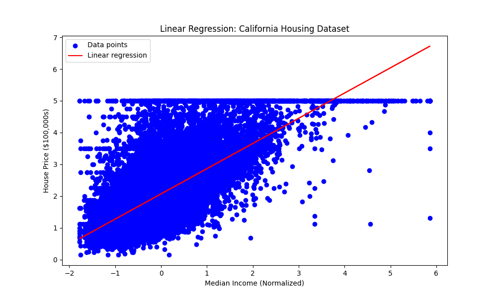
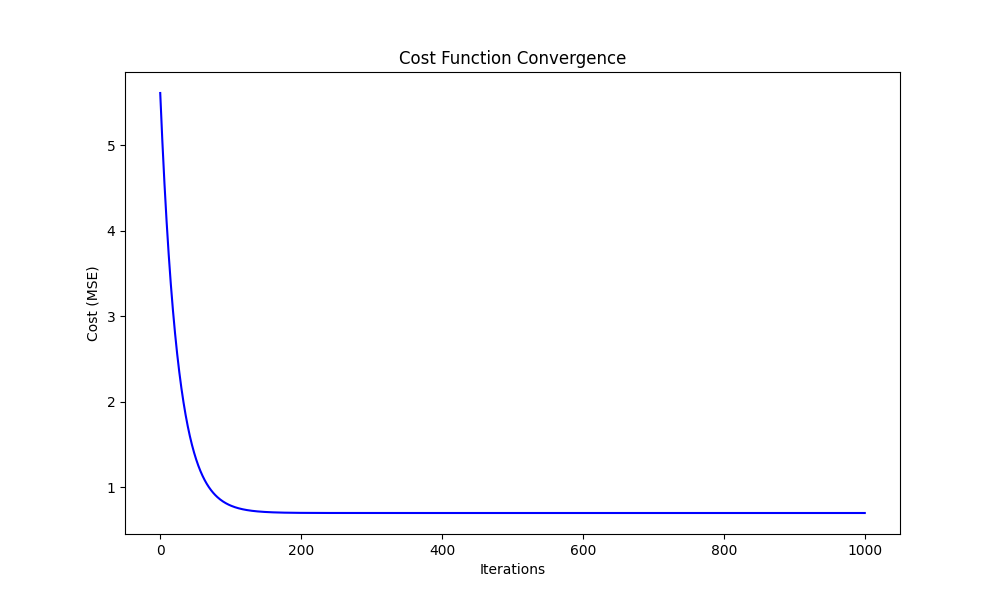

# Linear Regression from Scratch

## Overview
This project implements a linear regression model from scratch using Python (NumPy, Pandas, Matplotlib) on the Califoria Housing dataset. It predicts house prices based on the number of rooms, demonstrating core machine learning concepts like gradient descent and cost functions.

## Architecture
- **Dataset**: Califoria Housing (public dataset from scikit-learn).
- **Feature**: Average number of rooms (RM).
- **Algorithm**: Linear regression with gradient descent.
- **Visualizations**: Regression line and cost convergence plots.




## Setup Instructions
1. Clone the repository:
   ```bash
   git clone https://github.com/nishaero/ai-infra-journey/linear-regression.git
   cd ai-infra-journey/linear-regression
   ```

2. Install dependencies:

    ```bash
    pip install numpy pandas matplotlib scikit-learn
    ```


3. Run the script:

    ```bash
    python linear_regression.py
    ```

## Prerequisites

* Python 3.7+
* Libraries: NumPy, Pandas, Matplotlib, scikit-learn

## Results

* Learned parameters: Intercept and slope for predicting house prices.

* Visualizations show the fitted regression line and cost function convergence.

## Learnings

* Implemented gradient descent from scratch.
* Applied data preprocessing (normalization) for better convergence.
* Visualized ML results using Matplotlib.