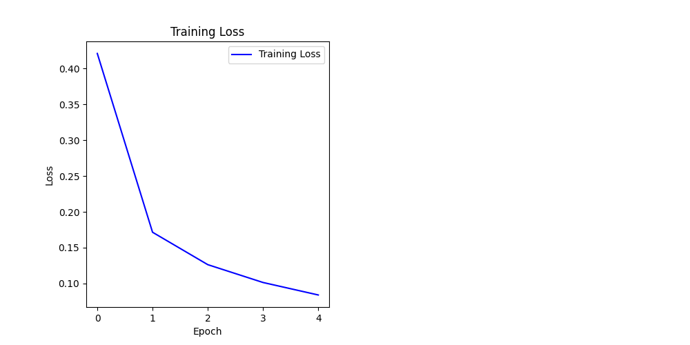
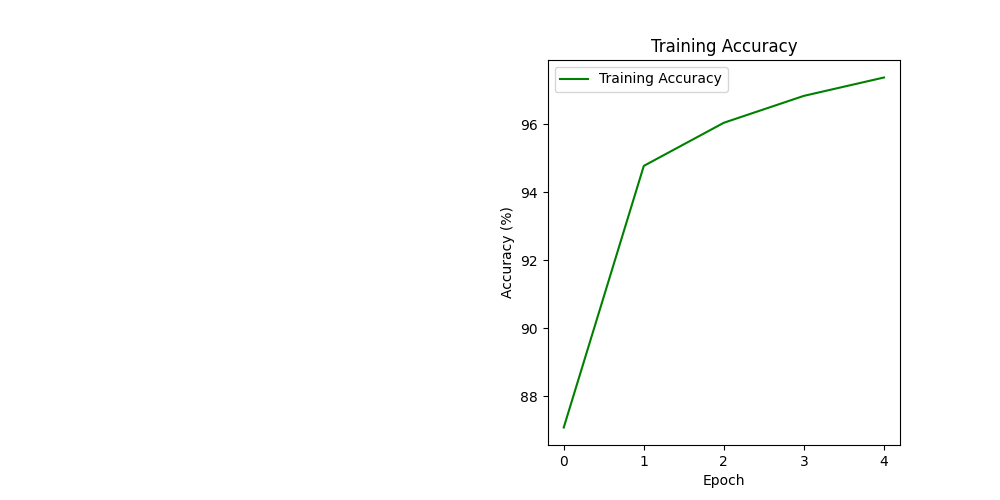
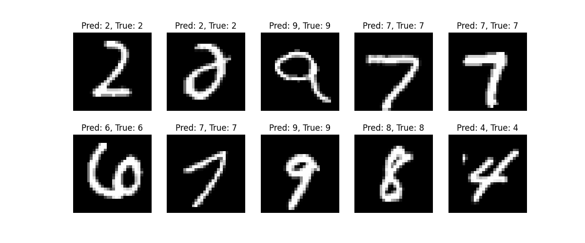

# CI/CD Pipeline for ML Models
## Overview

This project sets up a CI/CD pipeline using GitHub Actions to automate testing of a neural network for MNIST classification. It uses PyTorch for training on GPU/CPU (via RunPod) and MLflow for model versioning, metric tracking, and infrastructure monitoring.

## Architecture

* Dataset: MNIST (28x28 grayscale images of digits 0-9).
* Model: Feedforward neural network with two hidden layers (128 and 64 neurons, ReLU activations).
* Training: Stochastic gradient descent (SGD) with cross-entropy loss for 5 epochs.
* Pipeline: GitHub Actions for automated testing.
* Tracking: MLflow logs metrics (loss, accuracy, CPU/GPU usage) and model.
* Visualizations: Training loss, accuracy, and sample predictions.






## Setup Instructions


1. Clone the repository:

    ```bash
    git clone https://github.com/nishaero/ai-infra-journey.git
    cd ai-infra-journey/ml-cicd-pipeline
    ```

2. Install dependencies:

    ```bash
    pip install torch torchvision mlflow matplotlib psutil pytest
    ```

3. Run the script (on RunPod):

    ```bash
    python neural_network.py
    ```
4. Run Tests:

    ```bash
    python test_neural_network.py
    ```

## Prerequisites

* Python 3.12+
* Libraries: PyTorch, torchvision, MLflow, Matplotlib, psutil, pytest
* Hardware: GPU(RunPod)

## Results

* Achieved ~95%+ accuracy on the MNIST training set after 5 epochs.
* Visualizations show loss/accuracy trends and sample predictions.
* Automated tests verify data loading and model output.
* MLflow tracks metrics, model, and infrastructure usage (CPU/GPU).

## Learnings

* Integrated MLflow for model versioning and infrastructure monitoring.
* Set up a CI/CD pipeline with GitHub Actions.
* Optimized training for GPU/CPU environments using RunPod.
