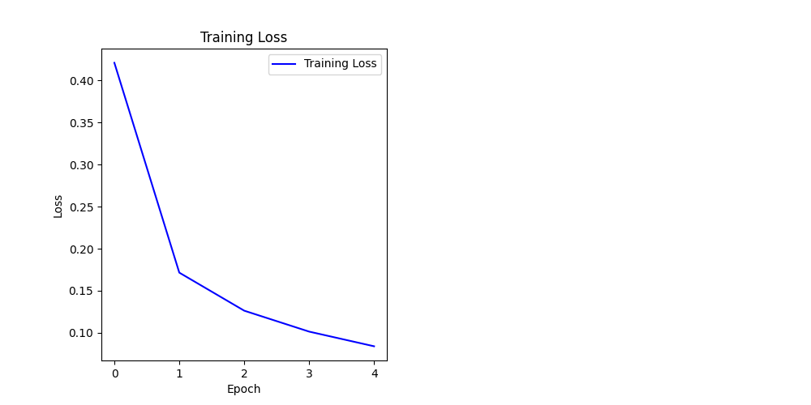
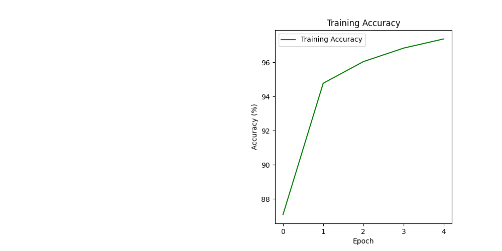
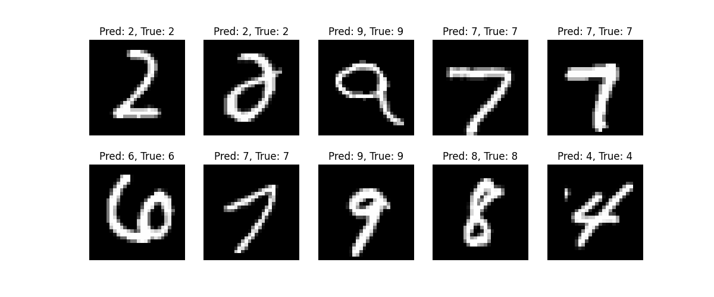

# Neural Network for MNIST Classification
## Overview

This project implements a feedforward neural network using PyTorch to classify handwritten digits in the MNIST dataset. It demonstrates deep learning concepts like neural network architecture, backpropagation, and training loops, optimized for a CPU with 16GB RAM.

## Architecture

* Dataset: MNIST (28x28 grayscale images of digits 0-9).
* Model: Feedforward neural network with two hidden layers (128 and 64 neurons, ReLU activations).
* Training: Stochastic gradient descent (SGD) with cross-entropy loss for 5 epochs.
* Visualizations: Training loss, accuracy, and sample predictions.






## Setup Instructions


1. Clone the repository:

    ```bash
    git clone https://github.com/nishaero/ai-infra-journey.git
    cd ai-infra-journey/neural-network
    ```

2. Install dependencies:

    ```bash
    pip install torch torchvision matplotlib
    ```

3. Run the script:

    ```bash
    python neural_network.py
    ```


## Prerequisites

* Python 3.7+
* Libraries: PyTorch, torchvision, Matplotlib
* Hardware: CPU (optimized for 16GB RAM)

## Results

* Achieved ~95%+ accuracy on the MNIST training set after 5 epochs.
* Visualizations show loss/accuracy trends and sample predictions.

## Learnings

* Built a neural network using PyTorch on a CPU.
* Implemented training with backpropagation and SGD.
* Optimized model size for resource-constrained systems.
* Visualized training metrics and model predictions.
