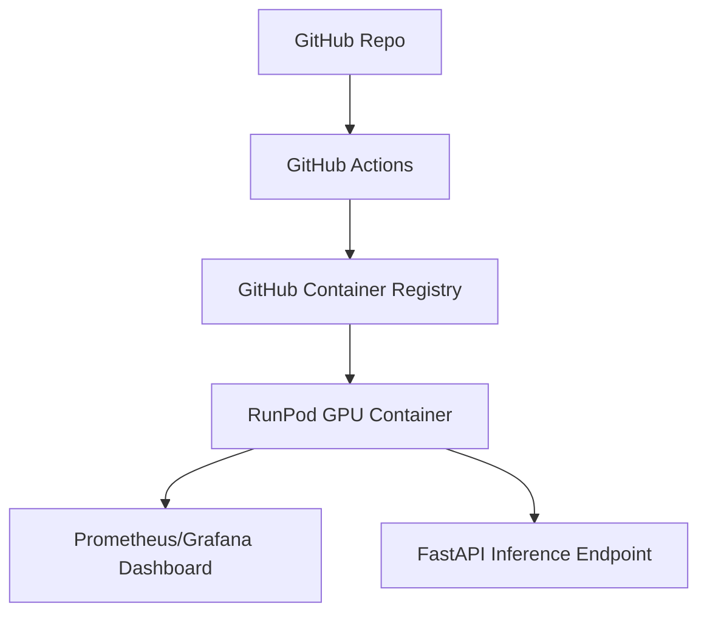

# AI Inference on RunPod with GitHub Actions & Container Registry

## Overview
- **Infra:** RunPod (GPU), GitHub Actions, GitHub Container Registry
- **Tools:** MLflow, FastAPI, Prometheus
- **Features:** Automated CI/CD, GPU inference, metrics, secure API

## Architecture

## Workflow
1. Code pushed to GitHub
2. Actions build & test Docker image
3. Image pushed to ghcr.io
4. RunPod pulls image, runs with GPU
5. FastAPI exposes inference endpoint; metrics sent to Prometheus
6. Optional: Security (JWT, NetworkPolicy), auto-scaling, chaos engineering

## How to Deploy
- [ ] Fork repo and set up GitHub Actions secrets
- [ ] Build and push Docker image (automated)
- [ ] Launch on RunPod via dashboard/API
- [ ] Monitor with Grafana
